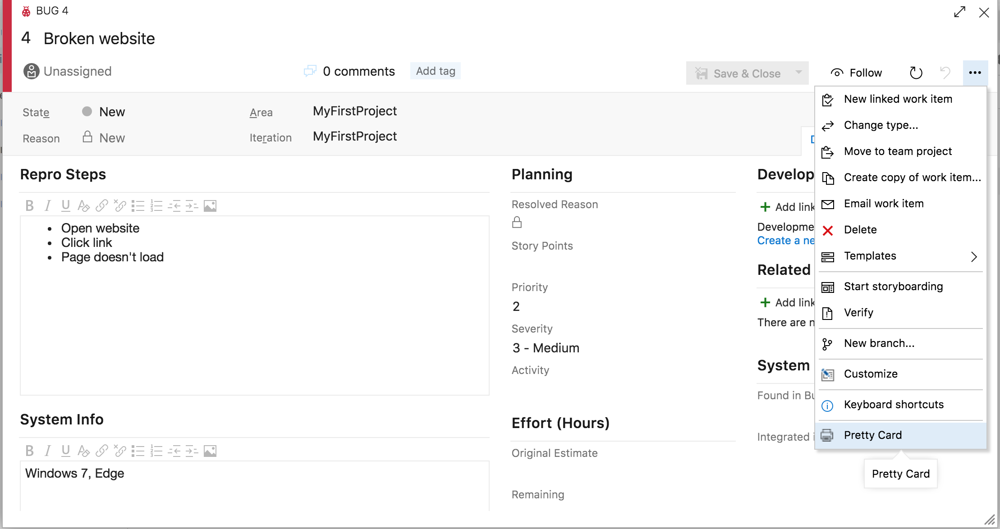
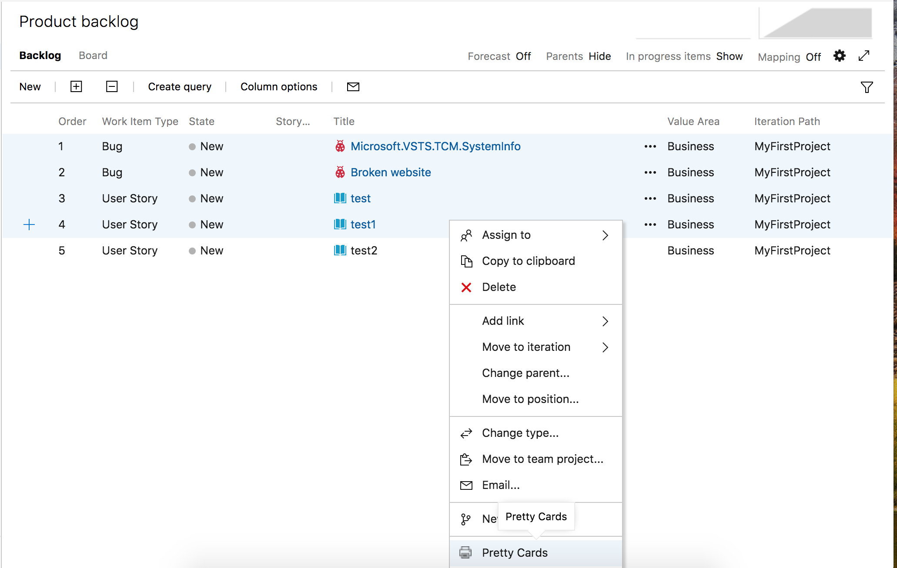
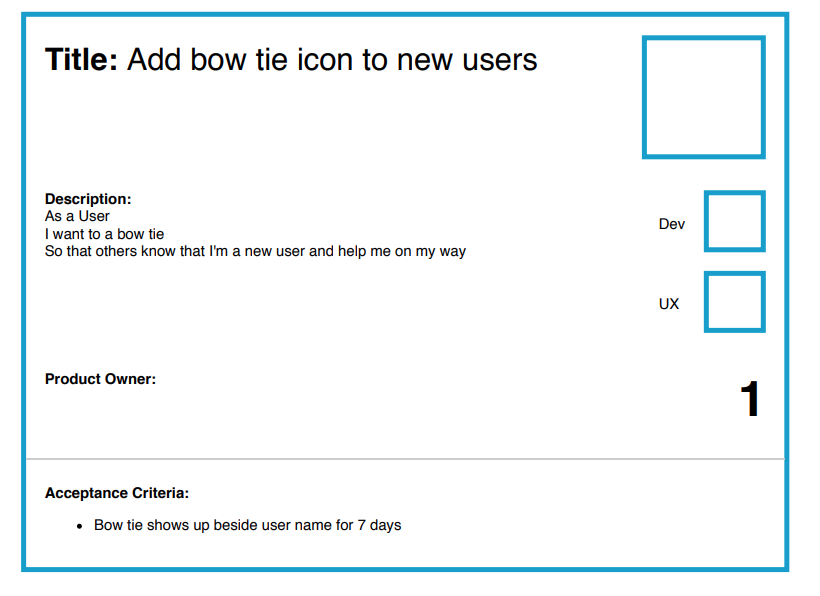
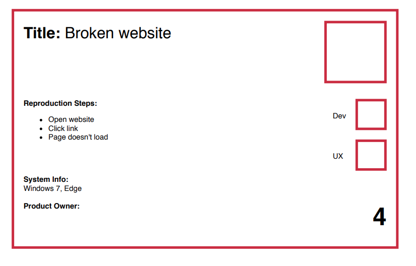

# Pretty Cards

Print work items in a way that works great for agile/scrum boards.

## Printing

 - Open a work item, click the 3 "..."'s, click `Pretty Card` OR
 - Right-click on a work item and select `Pretty Card` OR
 - Ctrl + click multiple items, right click and select `Pretty Cards`

## Templates

Only supports user stories and bugs.

## Credits

Based on [WIPrint](https://github.com/MrTarantula/WIPrint)